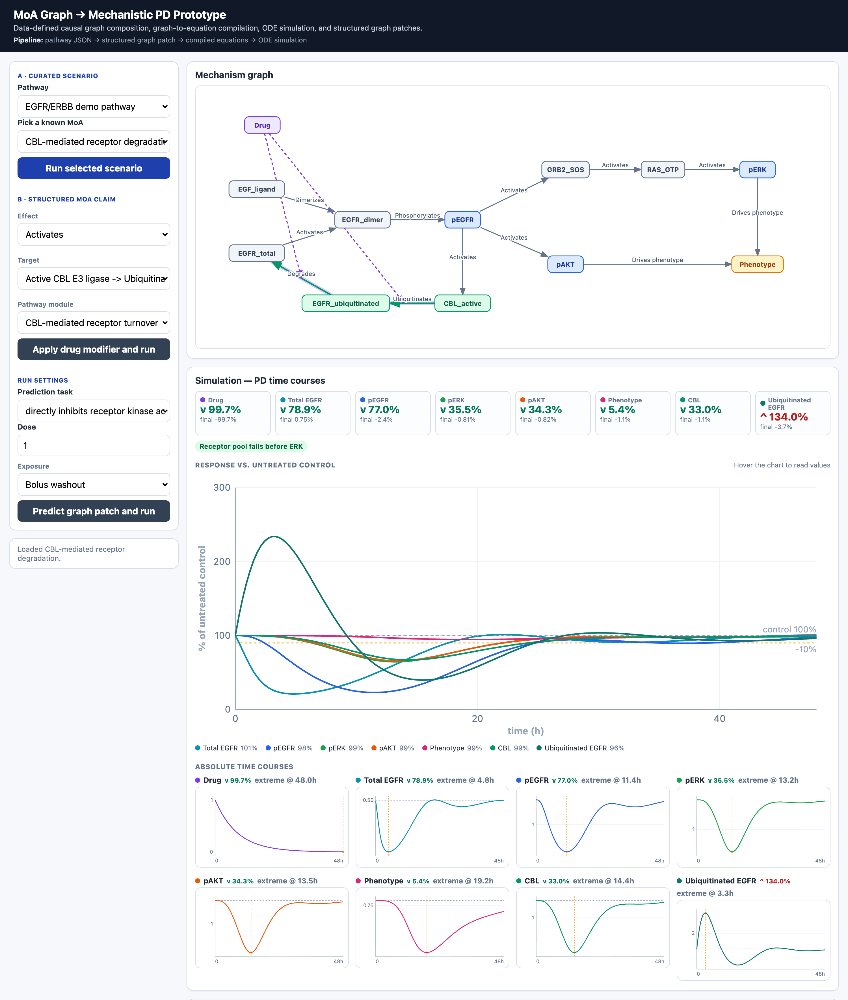

# MoA PD Prototype

A demo application for turning structured mechanism-of-action (MoA) hypotheses into executable pharmacodynamic (PD) simulations.

The prototype starts from a pathway definition in JSON, composes a typed causal graph, applies drug-effect graph patches, compiles the graph into equation terms, and runs ODE time-course simulations. It includes a small browser workbench, a FastAPI service, demo pathway data, and tests that show the graph compiler and simulator are pathway-driven rather than hard-coded to one biological example.

The current demo pathway is an EGFR/ERBB signaling model with optional CBL-mediated receptor turnover. It supports curated MoA scenarios such as ligand blockade, direct kinase inhibition, downstream pathway blockade, and CBL-driven receptor degradation.



*The browser workbench running the curated **CBL-mediated receptor degradation** scenario — sidebar controls, the composed mechanism graph, and the **Simulation — PD time courses** panel.*

## What it demonstrates

- **Data-defined pathways:** nodes, edges, modules, parameters, initial conditions, plot metadata, logic checks, and prediction hints live in `data/pathways/`.
- **Typed MoA graphs:** pathway graphs represent biological entities, causal relations, drug modifiers, evidence, provenance, signs, confidence, and executable state bindings.
- **Composable pathway modules:** optional modules can add graph structure, homeostasis terms, and biological logic checks before compilation.
- **Structured graph patches:** predefined drug effects and ad hoc edge modifiers can target structural edges in the composed graph.
- **Graph-to-equation compilation:** causal edges and modifiers compile into expression IR and state equations with parameter catalogs and diagnostics.
- **Mechanistic simulation:** compiled models run through an ODE simulator with bolus washout or sustained exposure settings.
- **PD readouts:** simulations return absolute time courses, control-normalized series, summary metrics, and pathway-owned biological logic checks.
- **Toy graph-patch prediction:** a lightweight predictor ranks or applies candidate edge modifiers from supported claim text and can include relevant pathway modules.
- **API and UI parity:** the browser workbench is a thin client over the same API endpoints used by scripts and tests.
- **Paper annotation review artifacts:** annotation bundles can be converted into connected, provenance-rich MOA/PK/PD evidence graphs and review-only pathway proposals without modifying runtime pathways.

## Demo workflow

The browser UI is intentionally structured rather than free text. From the first screen you can:

1. Select a pathway and a curated MoA scenario.
2. Compose the mechanism graph and inspect graph edges, provenance, and modifier patches.
3. Compile graph edges into displayed equation terms.
4. Simulate PD time courses and compare responses against untreated control.
5. Apply a structured drug modifier by choosing an effect, a target edge, and an optional pathway module.
6. Run the toy graph-patch predictor on supported claim examples and simulate the patched graph.

## Quickstart

Install dependencies and run verification:

```bash
uv sync
uv run pytest
uv run ruff check apps services scripts tests
uv run basedpyright apps services scripts tests
node --check apps/web/app.js
```

Start the app:

```bash
uv run uvicorn apps.api.main:app --reload
```

Open:

- UI: `http://127.0.0.1:8000/`
- API docs: `http://127.0.0.1:8000/docs`

## Repository layout

```text
apps/api/                    FastAPI app, request/response schemas, UI transport
apps/web/                    Browser workbench served by the API
data/pathways/               Executable pathway JSON definitions
data/paper_annotations/      Raw paper annotation bundles
data/annotation_graphs/      Generated connected evidence graph review artifacts
data/pathway_proposals/      Generated review-only pathway proposal artifacts
services/pathway/            Pathway loading, validation, contracts, graph composition
services/domain/             Typed graph, expression, compiled-model, warning, and simulation models
services/equation_compiler/  Data-driven graph-to-equation compiler
services/simulator/          ODE execution, metrics, validation, biological logic checks
services/predictor/          Toy graph-patch predictor and recommendation application
services/annotation_import/  Paper annotation ingestion, provenance, evidence graph, and proposal generation
scripts/                     Demo output and predictor evaluation scripts
tests/                       API, runtime, compiler, simulator, predictor, and synthetic-pathway tests
demo_outputs/                Generated sample graphs, models, simulations, and CSV time courses
```

## API surface

| Method | Path | Purpose |
|---|---|---|
| `GET` | `/health` | Service health check and loaded pathway IDs |
| `GET` | `/pathways` | List available pathway definitions |
| `GET` | `/pathways/{pathway_id}` | Return the loaded pathway definition |
| `GET` | `/pathways/{pathway_id}/contract` | Return UI-facing configurations, modules, modifier relations, prediction tasks, and presentation metadata |
| `GET` | `/annotation-graphs` | List available paper annotation bundles |
| `GET` | `/annotation-graphs/{paper_id}` | Build and return a connected paper evidence graph with provenance |
| `GET` | `/annotation-graphs/{paper_id}/proposal` | Build and return a review-only pathway proposal from the evidence graph |
| `POST` | `/graph/compose` | Compose a graph from pathway, configuration, modules, predefined effects, and ad hoc modifiers |
| `POST` | `/graph/patch` | Compose a graph through the same graph-operation boundary for patch-style clients |
| `POST` | `/model/compile` | Compile a composed graph into equation terms and executable model metadata |
| `POST` | `/simulate` | Run ODE time-course simulation from a graph or compiled model |
| `POST` | `/predict/operators` | Rank graph edge-modifier candidates for a supported claim |
| `POST` | `/predict/operators/apply` | Apply recommendations, compile the patched graph, and simulate it |

Example graph composition request:

```bash
curl -X POST http://127.0.0.1:8000/graph/compose \
  -H 'Content-Type: application/json' \
  -d '{"pathway_id":"egfr_erbb_demo","configuration":"cbl_degradation"}'
```

## Pathway model

The pathway JSON is the runtime source of truth. A pathway can define:

- base graph nodes and edges
- optional modules and module-specific logic checks
- named configurations for curated demo scenarios
- drug-effect patches that modify structural graph edges
- expression overrides and homeostatic equation terms
- parameter priors and generated-parameter defaults
- simulation initial conditions and plotted states
- predictor training cases, keywords, and guardrails

This keeps pathway-specific biology in data while the composer, compiler, simulator, predictor, API, and UI operate against generic typed contracts.

## Demo data generation

Generate sample outputs for each configured pathway graph recipe:

```bash
uv run python scripts/demo.py
uv run python scripts/evaluate_predictor.py
```

`scripts/demo.py` writes composed graphs, compiled models, simulation JSON, CSV time courses, a comparison summary, and a sample new-claim prediction under `demo_outputs/`.

## Verification

The test suite covers:

- pathway loading and schema validation
- module include/exclude behavior
- arbitrary ad hoc edge modifiers
- graph compilation and generated parameters
- ODE simulation and control-normalized summaries
- data-defined biological logic checks
- graph-patch prediction with module inclusion
- API flows from graph composition through simulation
- static UI contract checks
- a synthetic non-EGFR pathway to guard against pathway-specific compiler or simulator code

Run all checks:

```bash
uv run pytest
uv run ruff check apps services scripts tests
uv run basedpyright apps services scripts tests
node --check apps/web/app.js
```

## Project status

This is a focused prototype for demo and evaluation purposes. It is not intended to be a calibrated biological model or a validated drug-discovery platform. The useful slice is the software workflow: pathway-owned graph data, generic graph composition, equation compilation, simulation, diagnostics, and structured patching.
